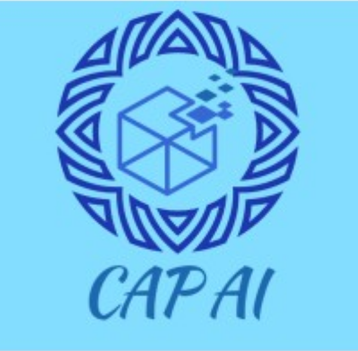

# CAP AI — Borrowings & Loan Covenants Audit Analytics

Enterprise-grade Streamlit application for borrowings audit, loan covenant monitoring, interest verification, security/ROC compliance, and end-use analysis. Built for banking and statutory audit engagements.



## Features

- **Executive Dashboard** — KPI cards, sparklines, trend indicators, recent alerts
- **Excel Import** — Multi-file upload with drag & drop, column mapping, validation
- **Covenant Monitoring** — DSCR, Current Ratio, Debt Equity, Interest Coverage
- **Interest Verification** — Recomputation engine with variance analysis
- **Loan Schedule** — Disbursement, repayment, EMI, overdue verification
- **Security & ROC** — CHG-1/4/9 compliance, charge verification
- **End-use Monitoring** — Diversion detection, risk scoring
- **Analytics** — Treemap, sunburst, heatmap, gauge charts
- **Reports** — PDF, Excel, Word, CSV export with branded logo
- **AI Insights** — Automated audit observations and recommendations

## Quick Start

```bash
cd Borrowings_Audit_App
pip install -r requirements.txt
streamlit run app.py
```

## Demo Credentials

| Username | Password    |
|----------|-------------|
| admin    | admin123    |
| auditor  | audit@2024  |

## Project Structure

```
Borrowings_Audit_App/
├── app.py                 # Main entry point
├── assets/                # Logo, CSS, backgrounds
├── modules/               # Page modules
├── utils/                 # Calculations, validators, exporters
├── templates/             # Excel templates
├── sample_data/           # Demo datasets
└── requirements.txt
```

## Supported Excel Sheets

- Loan Master
- Interest Schedule
- Repayment Schedule
- Bank Statements
- Security Details
- ROC Details
- Drawdown Register
- Utilization Register
- Covenant Details

## Brand Colors

| Color | Hex       | Usage              |
|-------|-----------|--------------------|
| Navy  | `#1B3A6B` | Headers, buttons   |
| Blue  | `#2E6DB4` | Accents, links     |
| Sky   | `#7EC8E3` | Backgrounds        |

## License

© 2024 CAP AI. Confidential — For audit engagement use only.
"# Borrowings-Audit-Analytics" 
